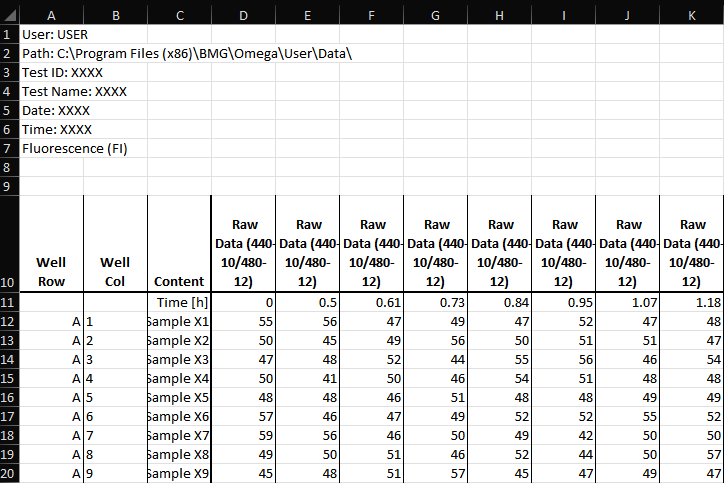
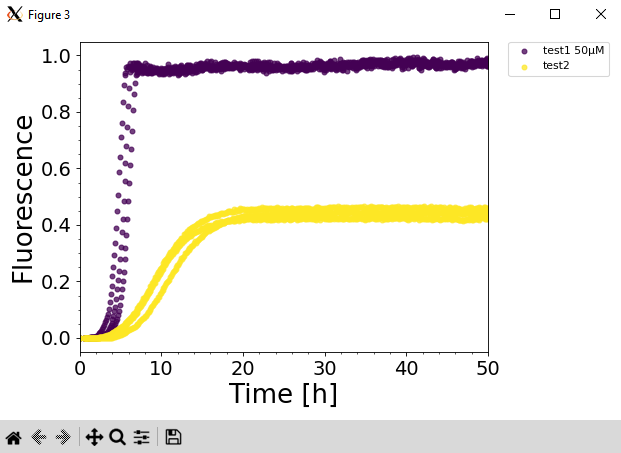

# ThT Analysis GUI

### Author: Jack P Connor

## Intallation
All the required dependancies can be installed with the following line:
`pip install tkinter pandas matplotlib numpy scipy math`

## General Overview
This code uses TKinter to create a GUI built for analysing ThT assays using data directly from a plate reader as the input.
First, select which data you would like to analyse and it will bring you to the analysis screen. 
From here you can select the wells you wish to analyse by clicking on them. 
You are then able to specify how you want the results to be plotted including normalisation and curve fit equations.
From the GUI you can directly save plots, save the raw data in a tidy format and save the calculated fit parameters.

## Example Usage
The first screen asks for you to select the data you wish to analyse.

This script has been designed to work with .xlsx files taken directly from the plate reader

After selecting the data you wish to analyse, you are brought to the main analysis window. Here you are able to select the wells you wish to analyse and change a variety of parameters:
* Protein name
* Protein concentration
* Fit equations (Not fully implemented yet)
* Global, local or no normalisation
* Plot labes, axis limits and colour palette

Shown below is an example selection of 3 wells with a specified protein name and concentration, limiting the x-axis to 50 hours and using global normalisation. The wells are selected by clicking on the well buttons and finalising the selection by pressing the select wells button.

Information of the current selected wells appears on the right of the 96 well grid where it provides information on the selection and the calculated fit parameters.

The selected wells can be visualised by pressing "Plot Last" which plots the wells of the last selection event.

This process is then repeated for a second selection which is given another protein name but no specified concentration.

After you have finished selecting all the wells of interest, you are able to use the "Plot All" button to plot all the selected groups together.

Here is a second example showing the same data but using local normalisation instead of global.

